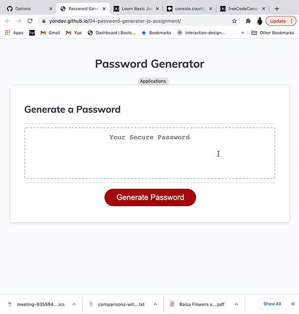
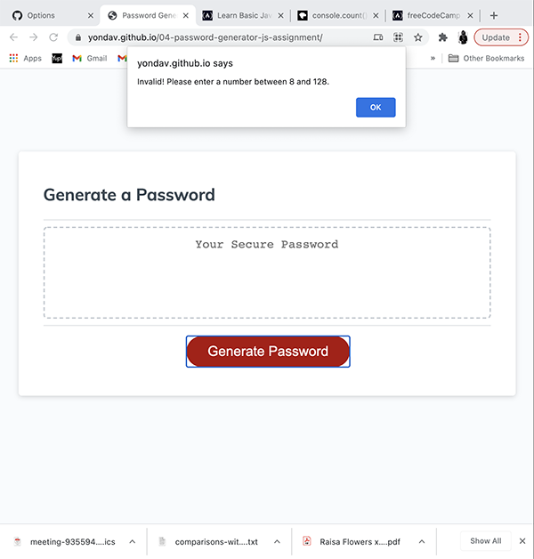

# 04-password-generator-js-assignment

Here we have a password generator which was given to me with the original html and css in tact. I've modified the javascript to allow the application to function as required.

## The Process
Once the user lands on the page and engages the "Generate Password" button, they will receive a series of prompts.
- First the user will be prompted to input a preferred password length ranging from 8 to 128 characters. If the user inputs an invalid number or character, they will be alerted to correct their input.
- After having selected a valid password length, the user will be prompted to determine whether or not they would like to include lowercase letters, uppercase letters, numbers and special characters.
- The user should select "OK" if they wish to include the given character type and "Cancel" if not.
- After the user has successfully responded to all of the prompts, a random password will be displayed for the user to copy and use as they choose.

## Deployed Webpage
https://yondav.github.io/04-password-generator-js-assignment/

## Please follow these steps to navigate the repository
- Ensure you are on the main branch
- Open index.html to access the html file
- Nested in the assets folder, you will find three folders titled css, js and README-assets
- You can access the css stylesheet: style.css inside the css folder
- You can access the javascript file: script.js inside the js folder
- The gifs and screenshot provided in this README file are located in the folder titled README-assets

Copyright (c) [2021] [Jonathan David]